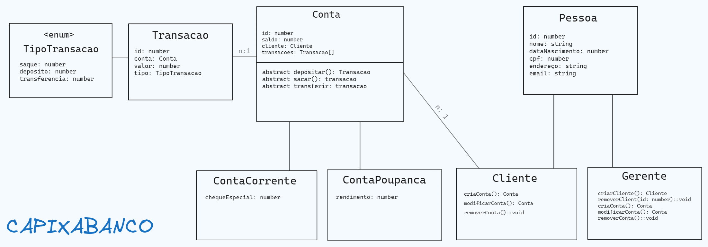

# Capixabanco #

#### Qual paradigma de programação seria mais indicado para implementar nesse sistema?
Dado os inúmeros atores existentes no sistema e suas interações foi escolhido o paradigma de programação orientada a objetos.

#### Diagrama do projeto

    
#### Fluxo de transação bancária
Segue abaixo o diagrama de fluxo de transação representando os métodos da classe Conta.

